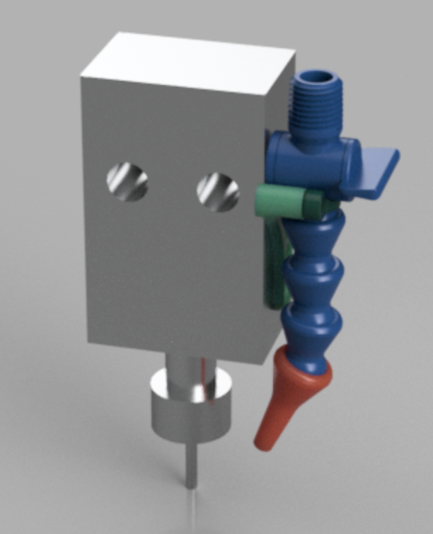
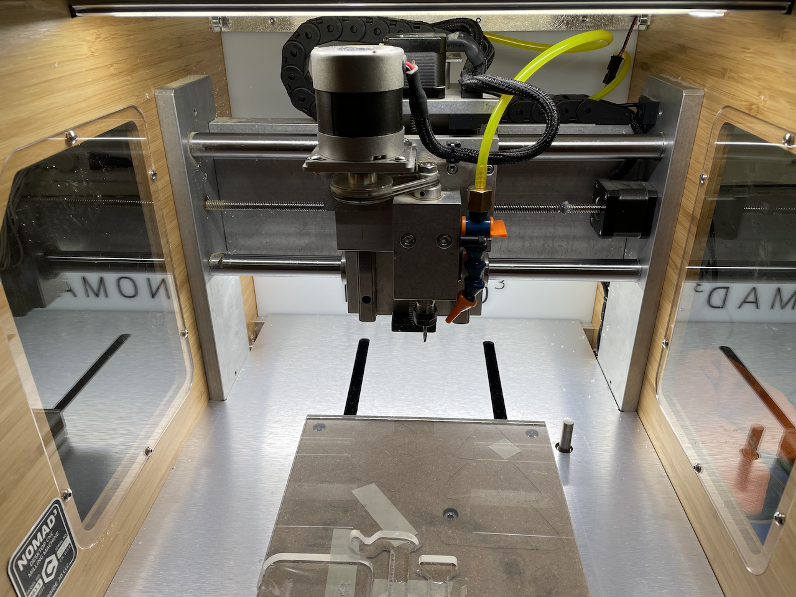

# Mods for the Nomad 3 CNC machine

## Air blast chip clearing

### Bill of Materials
Item | Link | Note
---- | ---- | ----
Loc-line | https://www.amazon.com/gp/product/B002065OXK/ | Use real 1/4" loc-line. Only need 1 "section", 1 valve and 1 nozzle.
Loc-line pliers | https://www.amazon.com/gp/product/B006R9OT8M/ | Nice to have, unnecessary.
Air pressure regulator | https://www.amazon.com/gp/product/B00IDCYKEY/ | Consistent pressure within loc-line limits.
Tube 1/8" | https://www.amazon.com/gp/product/B000PHF06C/ | You can use 1/4" tubing instead. It's tight in the drag chain though.
Loc-line 1/8" barb | https://www.amazon.com/gp/product/B006PKL2GU/ | 
Regulator 1/8" barb | https://www.amazon.com/gp/product/B0058I180U/ | 
M4x6 button head screws | | Need 2.
5mm OD M3 threaded inserts | | Need 2.  If you 3d print your bracket you will want to chase the holes with a 5mm bit.
M3x8 button head screws | | Need 2.

You will also need a 1/4" NPT male -> your compressor connection but I don't know what kind of compressor fittings you have.

### Parts to manufacture

* [Bracket](./models/air_blast_bracket.stl)
* [Bracket lock](./models/air_blast_lock.stl)

### Notes
If 3d printing the bracket, you'll want to have several walls.  It's a small bracket and you should make it as rigid as you can.  ASA or Alloy910 should work perfectly, ABS or PLA should be okay too.

Affix the bracket to the loc-line valve before putting the bracket on the tool head.  This way you can check the tolerances and make sure the bracket fits snugly and correctly.

Run the air hose through the X axis drag chain for a neat install.  Be mindful of the wiring.

Poke a small hole in the rear right of the back panel for the hose to go through, bolt the regulator bracket to the rear right of the CNC machine, connect the hose and get your compressor out.

